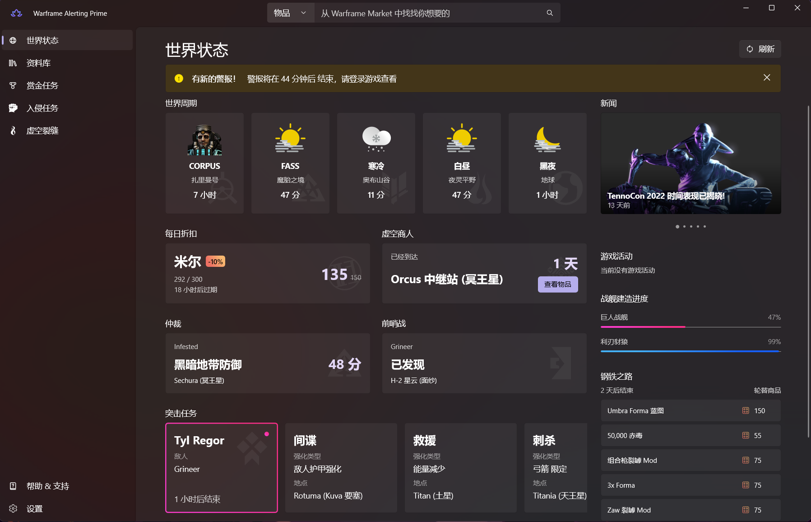

# Warframe Alerting Prime

    

`Warframe Alerting Prime` 现在为 Windows 11 设计！
  

---

`Warframe Alerting Prime` 是 [Warframe 国际服](https://www.warframe.com/zh-hans) 的衍生应用，集成 [WFCD](https://github.com/WFCD) 和 [Warframe Market](https://warframe.market/) 来为用户提供游戏内信息查询，物品交易查询等功能.

## 🙌 简单的开始

***WFA 仅支持 Windows 10 1903 及以上的系统（包括 Windows 11）***

> **商店版本** 和 **侧加载版本** 可以共存

### 从商店安装 (推荐)

将链接 `ms-windows-store://pdp/?productid=9MV8KGSLRVTF` 复制到浏览器地址栏打开，或在 Microsoft Store 中搜索 Warframe Alerting Prime，即可从 Microsoft Store 下载。

### 侧加载 (Sideload)

如果你想本地安装 Warframe Alerting Prime，或者尝试当月的最新功能。请打开右侧的 [Release](https://github.com/Richasy/Wfa.Uwp/releases) 页面，找到最新版本，并选择适用于当前系统的安装包下载。

然后打开 [系统设置](ms-settings:developers)，打开 `开发者模式` ，并等待系统安装一些必要的扩展项。

在应用压缩包下载完成后，解压压缩包，并在管理员模式下，使用 **Windows PowerShell** *(不是PowerShell Core)* 运行解压后的 `install.ps1` 脚本，根据提示进行安装。

**Watch** 项目，以获取应用的更新动态。

关于如何一步步地使用侧加载 (Sideload) 方式安装 UWP 应用及订阅应用更新，同样的步骤可以参考我在哔哩项目中写的文档： [下载并安装哔哩的详细说明](https://github.com/Richasy/Bili.Uwp/wiki/%E4%B8%8B%E8%BD%BD%E5%B9%B6%E5%AE%89%E8%A3%85%E5%93%94%E5%93%A9%E7%9A%84%E8%AF%A6%E7%BB%86%E8%AF%B4%E6%98%8E) 。

## ❓ 常见问题

在应用的安装使用过程中，你可能会碰到一些问题，这篇文档也许可以帮助你解决遇到的困难：[常见问题](https://github.com/Richasy/Wfa.Uwp/wiki/%E5%B8%B8%E8%A7%81%E9%97%AE%E9%A2%98)

## 📃 文档

所有关于 `Warframe Alerting Prime` 的文档，包括架构、使用说明等，都放在仓库的 [Wiki](https://github.com/Richasy/Wfa.Uwp/wiki) 中，如果你发现有文档缺失或错误，请提交 [Issue](https://github.com/Richasy/Wfa.Uwp/issues/new/choose) 说明错漏的内容。

## 🚀 协作

非常感谢有兴趣的开发者或爱好者参与 `Warframe Alerting Prime` 项目，分享你的见解与思路。对于任何有兴趣想为 `Warframe Alerting Prime` 做出贡献的小伙伴，请参见我们的 [Warframe Alerting Prime Wiki](https://github.com/Richasy/Wfa.Uwp/wiki) 了解更多有关协作的内容和引导知识。

## 💬 讨论

借助 Github 平台提供的 Discussions 功能，对于一般讨论、提议或分享，我们都可以在 [Warframe Alerting Prime论坛](https://github.com/Richasy/Wfa.Uwp/discussions) 中进行，欢迎来这里进行讨论。

## 🧩 截图

